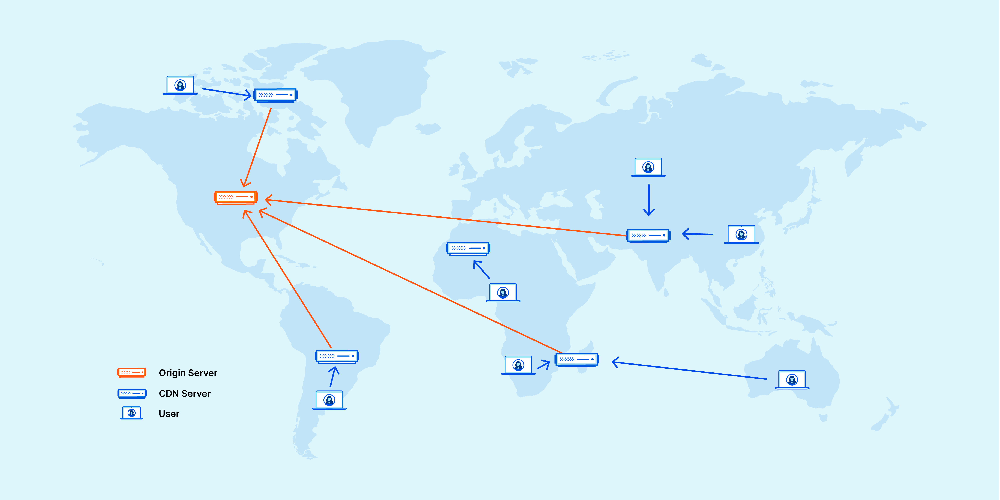

# CDN(Content Delivery Network)?
- 지리적으로 **분산된 서버들을 연결**한 네트워크
- 데이터 사용량이 많은 애플리케이션의 웹 페이지 로드 속도를 높이는 상호 연결된 서버 네트워크

## 중요한 이유
- 대기 시간을 줄이거나 네트워크 설계로 인해 발생하는 **통신 지연을 줄이는 것**
    - 웹 사이트(서버)와 사용자(클라이언트) 간의 통신 트래픽은 아주 먼 물리적 거리를 이동
    - 클라이언트에서 서버로 요청을 보내고 응답을 반환하는 양방향 통신
- 클라이언트와 웹 사이트 서버 간에 중간 서버를 두어 효율성을 높임
- 클라이언트-서버 통신의 일부를 관리
    - 웹 서버에 대한 웹 트래픽을 줄이고, 대역폭 소비를 줄이며, 애플리케이션의 사용자 환경을 개선

## 이점
- **페이지 로드 시간 단축**
  
  페이지 로드 시간이 너무 느리면 웹 사이트 트래픽이 감소할 수 있습니다. 
  
  CDN은 반송률을 줄이고 사용자가 사이트에서 보내는 시간을 늘릴 수 있습니다.

- `대역폭 비용 절감`

  들어오는 모든 웹 사이트 요청은 네트워크 대역폭을 사용하기 때문에 대역폭 비용이 상당히 높음

  → 오리진 서버가 제공해야 하는 데이터의 양을 줄웹 사이트 소유자의 호스팅 비용을 절감

- `콘텐츠 가용성 제고`

  한 번에 너무 많은 방문자가 방문하거나 네트워크 하드웨어 오류가 발생하면 웹 사이트가 중단

  → 더 많은 웹 트래픽을 처리하고 웹 서버의 로드를 줄임

  → 하나 이상의 CDN 서버가 오프라인으로 전환되면 다른 운영 서버가 해당 서버를 대체(서비스 중단 X)

- `웹 사이트 보안 강화`

  여러 중간 서버 간에 로드를 분산하여 오리진 서버에 미치는 영향을 줄임으로써 트래픽 급증을 처리

## 작동 원리
- 여러 지리적 위치에 접속 지점(POP) 또는 CDN 엣지 서버 그룹을 설정하는 방식
- 지리적으로 분산된 이 네트워크는 캐싱, 동적 가속 및 엣지 로직 계산의 원리를 기반으로 작동
---
> ### 캐싱
> 더 빠른 데이터 액세스를 위해 동일한 데이터의 여러 복사본을 저장하는 프로세스
> - 컴퓨팅에서 캐싱의 원리는 모든 유형의 메모리 및 스토리지 관리에 적용
> - 네트워크의 여러 서버에 정적 웹 사이트 콘텐츠를 저장하는 프로세스를 의미
>   > #### [CDN에서 캐싱](https://aws.amazon.com/caching/cdn/)
>   > 1. 지리적으로 멀리 떨어진 웹 사이트 방문자는 사이트에서 정적 웹 콘텐츠를 처음 요청
>   > 2. 요청이 웹 애플리케이션 서버 또는 오리진 서버에 도달 (오리진 서버는 원격 방문자에게 응답)
>   >   1. 해당 방문자와 지리적으로 가장 가까운 CDN POP에 응답 복사본을 보냄
>   > 3. CDN POP 서버는 복사본을 캐싱된 파일로 저장
>   > 4. 다른 방문자가 동일한 요청을 하면, 오리진 서버가 아닌 캐싱 서버가 응답

> ### 동적 가속
> 중개 CDN 서버로 인해 발생하는 동적 웹 콘텐츠 요청에 대한 서버 응답 시간을 단축
> - 모든 동적 요청에 대해 오리진 서버와 다시 연결해야 하지만 자신과 오리진 서버 간의 연결을 최적화 → 프로세스 가속화
> - 근처의 CDN 서버가 요청을 오리진 서버로 전달할 경우, 신뢰할 수 있는 지속적인 연결이 이미 설정

> ### 연결 최적화
> - 지능형 라우팅 알고리즘
> - 오리진에 대한 지리적 근접성
> - 클라이언트 요청을 처리할 수 있으므로 클라이언트 요청을 줄일 수 있습니다.

> ### 엣지 로직 계산
> 클라이언트와 서버 간의 통신을 단순화하는 논리적 계산을 수행하도록 CDN 에지 서버를 프로그래밍
> - 사용자 요청을 검사하고 캐싱 동작을 수정합니다.
> - 잘못된 사용자 요청을 확인하고 처리합니다.
> - 응답하기 전에 콘텐츠를 수정하거나 최적화합니다

## 역사
- `1세대`

  지능형 네트워크 트래픽 관리 및 데이터 센터 복제의 네트워킹 원칙에 초점

- `2세대`

  모바일 디바이스에서의 콘텐츠 전송의 새로운 과제를 해결하도록 발전

  → 회사에서는 클라우드 컴퓨팅 기술과 P2P 네트워크를 사용하여 콘텐츠 전송을 가속화

- `3세대` (여전히 발전하는 중)
  
  → 대부분의 웹 서비스가 클라우드에 집중되면서 지능적으로 통신하는 스마트 디바이스를 사용

  → 대역폭 소비를 관리하는 엣지 컴퓨팅에 초점
    - 자체 관리형 자율 엣지 네트워크가 CDN 기술의 다음 단계