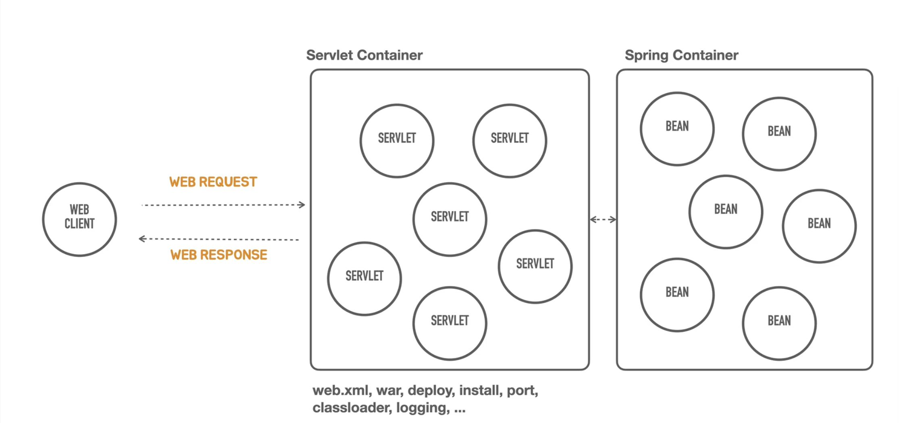
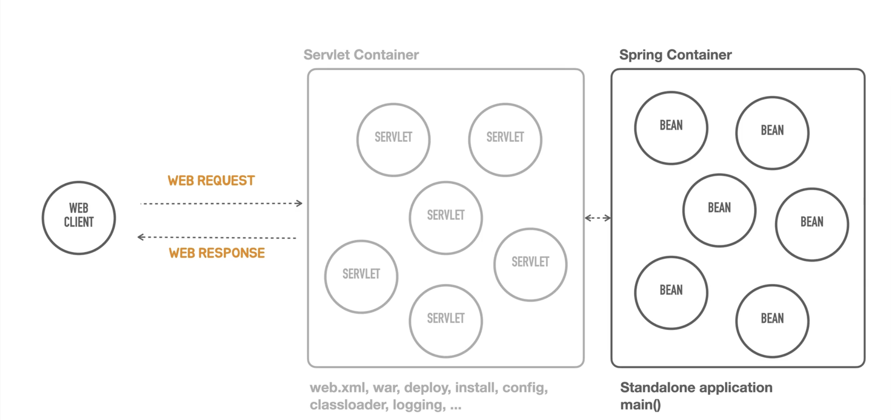

# Containerless
**컨테이너리스 웹 애플리케이션 아키텍처**
- Serverless(서버 관리, 설치를 신경쓰지 않고 개발해서 배포하고 운영 가능하도록)와 유사

> 컨테이너 관리를 신경쓰지 않아도 된다

## Servlet Container
- Servlet를 관리하는 역할
    - 하나의 웹 컴포넌트만 관리하지 않음
- 서버가 동작하는 동안에 Servlet를 관리 (ex. 라이프 사이클 관리)
- 클라이언트로부터 들어오는 요청을 특정 룰에 따라 어느 Servlet가 동작을 해야 할지 결정 **(라우팅 혹은 맵핑)**
- Tomcat

## Spring Container
- Servlet Conatainer 뒤에 존재
- Servlet Container를 통해 웹으로 들어온 요청을 Servlet이 받아서 스프링 컨테이너로 전달
    - 하나의 빈이 요청을 처리 (다른 빈을 요청하기도 함)
- 서블릿 컨테이너를 완전히 대체 X → 자바 표준 웹 기술을 사용하려면 Servlet Container가 존재해야 함

## 문제점
- 간단한 헬로월드 서버를 띄우려면 Servlet Container가 무조건 필요 (무조건 띄워져있어야 함)
    - Servlet Container를 띄우려면
      web.xml, war, tomcat install, deploy, classloader, logging 등등 많은 것들이 필요
      ⇒ 개발하는 것에 신경쓰지 않아도 될 것들까지 알아야 한다는 것 (진입 장벽이 높음)

⇒ 그래서 Servlet Container를 신경쓰지 않고 개발할 수 있도록 해줬으면 좋겠다.

---

**스프링 부트를 통해서 제공**됨 ⇒ 설정을 신경쓰지 않아도 개발하고 서버를 띄울 수 있음

    → 스프링을 개발하는 데에는 빈 등록을 통해 스프링 애플리케이션을 만들고 사용 가능 ⇒ Containless 개발 방법