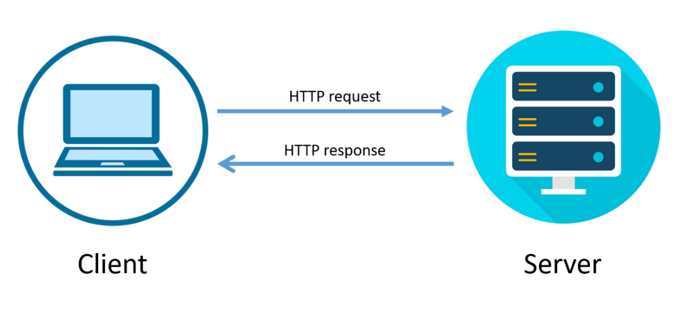

## HTTP : Hyper Text Transfer Protocol
- **클라이언트와 서버 사이**에 이루어지는 **요청/응답 프로토콜**
  - 웹에서 브라우저와 서버 간에 데이터를 주고 받기 위한 방식

> “**나는 이렇게 줄 테니 넌 이렇게 받고난 너가 준거 이런 식으로 받을 수 있으니 참고해줘”**



## Stateless : 상태 없음


- HTTP의 특징 : 상태가 없는 프로토콜 → **서로 각각의 통신이 독립적**
- 서버가 클라이언트의 상태를 유지하지 않기 때문에 요청을 보낼 때마다 모든 데이터를 매번 보내야 함
- 서버가 추가 정보를 관리하지 않아도 되고, 클라이언트가 아무 서버나 호출해도 된다
- 로그인과 같이 상태를 유지해야만 하는 경우, 쿠키와 세션 등을 사용해서 상태를 유지

### 그럼 왜 Stateful 사용 안 함?

서버가 많은 데이터를 가지고 있으면 **서버가 무거워지고**, 그로 인해 **요청을 빨리 처리하기 힘듬**

## HTTP Request

### Start Line : 요청의 첫 번째 줄

```text
EX. POST /users/login HTTP 1.1
```

- HTTP Method
- Request Target
- HTTP Version

### Header

> Host : 요청을 보내는 목표(타겟)의 주소 ⇒ 요청을 보내는 웹사이트의 기본 주소 
> 
> User-Agent : 요청을 보내는 클라이언트(웹 브라우저)의 대한 정보
>
> Accept-Encoding : 웹 브라우저에서 가능한 압축방식
> 
> Content-Type : 해당 요청이 보내는 메세지 body의 타입
> 
> Content-Length : body 내용의 길이
> 
> Authorization : 회원의 인증/인가를 처리 로그인 토큰을 Authroization 에 담는다
>
> If-Modified-Since : 현재 파일이 언제 마지막으로 다운받은 파일인지

### Body : 해당 요청의 실제 내용

```json
{
    "account_id" : "jyk1029",
    "password" : "qwertyuiop1234!"
}
```

## HTTPS : Hyper Text Transfer Protocol Secure
- **HTTP의 확장 버전**
  - 브라우저와 서버가 데이터를 전송하기 전에 **안전하고 암호화된 연결을 설정**

    [SSL/TLS](SSL&TLS.md)
