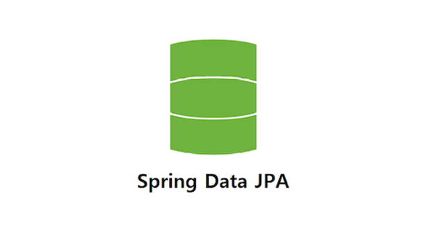
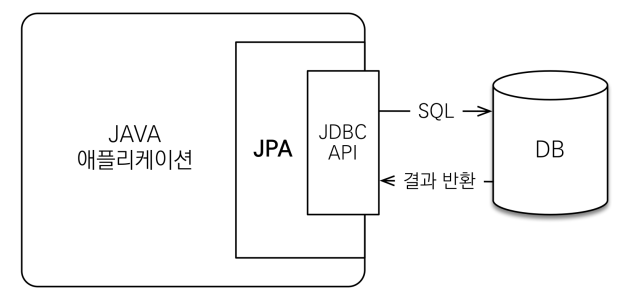
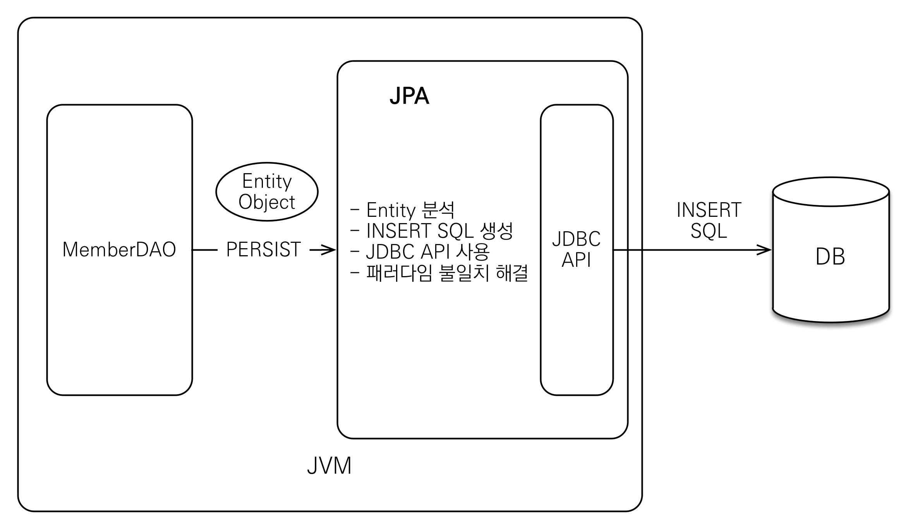
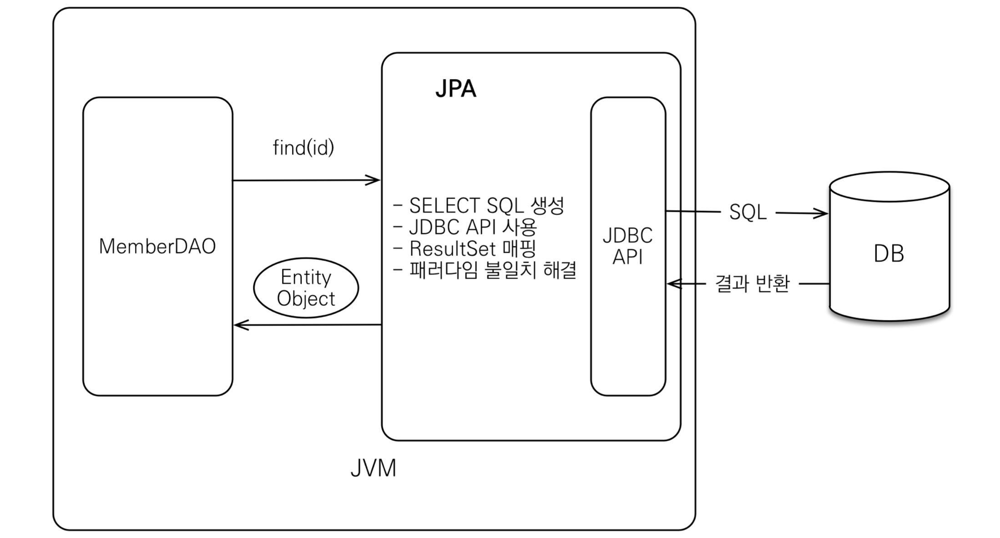
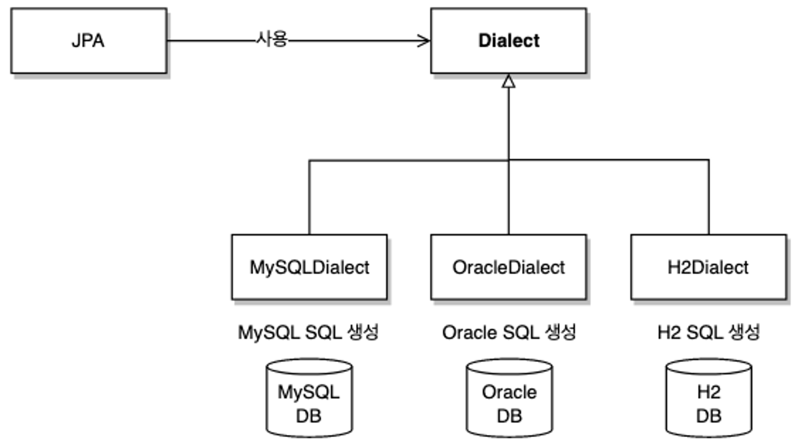

# JPA (Java Persistent API)
-  **자바 ORM 기술 표준**
- 자바 ORM 기술에 대한 API 표준 명세 (현재 JPA 2.1을 구현한 ORM 프레임워크는 하이버네이트가 가장 대중적)

> **JPA 표준 :** 일반적이고 공통적인 기능의 모음
> - 특정 기술에 대한 의존도를 줄일 수 있다
> - 다른 구현 기술로 손쉽게 이동할 수 있는 장점이 있다




## JPA 동작
### 애플리케이션과 JDBC 사이에서 동작

- JDBC API를 사용하여 데이터베이스와 데이터를 주고받게 된다.


- Java Collection에 저장하듯이 객체를 데이터베이스를 저장
- MemberDAO 클래스를 통해 persist()를 실행하면, JPA가 Entity 객체를 분석하여 SQL문을 생성
- JDBC API를 사용하여 DB에 생성된 INSERT SQL문 실행


- JPA를 통해 객체를 직접 조회
- MemberDAO 클래스를 통해 find(id)를 실행하면, JPA는 SELECT SQL을 생성
- JDBC API를 사용하여 생성된 SELECT SQL문 실행 
- DB에서 반환된 정보를 ResultSet 매핑을 통해 객체로 변환

> ## ORM? (Object-Relational Mapping)
> ### **```객체와 관계형 데이터베이스를 매핑```**
> ### ORM 프레임워크는 **다양한 패러다임 불일치 문제 해결**
> - *하이버네이트 프레임 워크가 가장 많이 사용


### JPA 버전별 특징
- `JPA 1.0` : 초기 버전. 복합 키와 연관관계 기능이 부족
- `JPA 2.0` : 대부분의 ORM 기능을 포함하고 JPA Criteria 추가
- `JPA 2.1` : 스토어드 프로시저 접근, 컨버터, 엔티티 그래프 기능 추가

## JPA 사용 이유
- 생산성
    - INSERT SQL을 작성하고 JDBC API를 사용하는 일은 JPA가 대신 처리
        ```
        jpa.persist(member) // 저장
        Member member = jpa.find(memberId) // 조회
        ```
    - DDL 자동 생성 기능 → 패러다임을 객체 설계 중심으로 역전
- 유지보수
    - 기존 : 엔티티에 필드 하나만 추가해도 관련된 SQL과 결과를 매핑하기 위한 JDBC API코드를 모두 변경
    - 필드를 추가하거나 수정, 삭제해야 할 코드 ⬇️ → 유지보수할 코드 수 ⬇️
    - 패러다임 불일치 문제를 핵ㄹ해주므로 객체지향 언어가 가진 장점 활용
      ⇒ 유연하고 유지보구하기 좋은 도메인 모델을 편리하게 설계
- **패러다임의 불일치 해결**
    - 상속, 연관관계, 객체, 그래프 탐색, 비교하기와 같은 패러다임 불일치 문제 해결
- 성능
    - 애플리케이션과 데이터베이스 사이에서 다양한 성능 최적화 기회 제공
    - 애플리케이션 ↔ 데이터베이스 사이에 동작
    ```
    String memberId = "helloId";
    Member member1 = jpa.find(memberId);
    Member member2 = jpa.find(memberId);
    ```
    - 위 코드처럼 JDBC API를 사용해서 직접 작성했다면 조회할 때마다 데이터베이스와 두 번 통신
      → JPA를 사용한다면 한 번만 데이터베이스에 전달하고 두 번째는 조회한 회원 객체를 재사용
- 데이터 접근 추상화와 벤더 독립성
  
    - 애플리케이션과 데이터 베이스 사이에 추상화된 데이터 접근 계층을 제공
      → 애플리케이션이 특정 데이터베이스 기술에 종속 X
        - 만약 데이터베이스를 변경하면 JPA에게 다른 데이터베이스를 사용한다고 알림만 가능