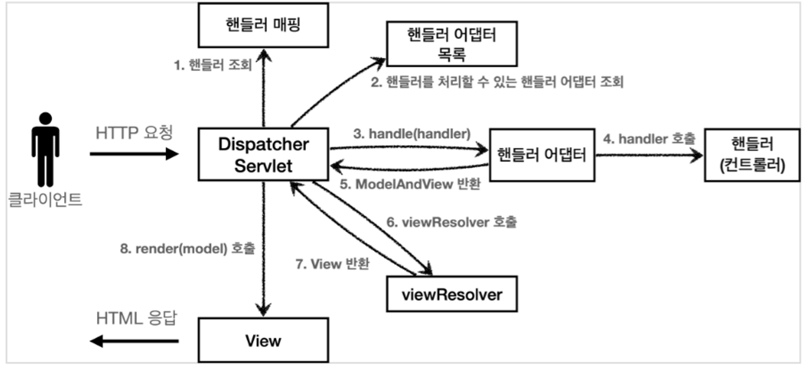

# Spring MVC (Model-View-Controller)
- 웹 계층에 Servlet API를 기반으로 클라이언트의 요청을 처리하는 모듈

> MVC 패턴?
> - 애플리케이션을 개발할 때 사용하는 디자인 패턴
> - 애플리케이션의 개발 영역을 MVC로 구분하여 각 역할에 맞게 코드를 작성하는 개발 방식

### Model
- 클라이언트에게 **응답으로 돌려주는 작업의 처리 결과** 데이터

### View
- **리소스(Resource)를 제공**하는 역할

### Controller
- **요청을 직접적으로 전달**받는 Endpoint
- Model과 View의 중간에서 상호작용

## Spring MVC 구조

### Dispatcher Servlet
- 요청부터 응답까지 전반적인 처리 과정 통제
- HttpServlet을 상속받아 사용하고 Servlet으로 동작
- DispatcherServlet → FrameworkServlet → HttpServletBean → HttpServlet
    - Servlet을 등록하면서 모든 경로에 (urlPatterns=”/”) 에 대해 매핑

### Handler Mapping
- 요청을 직접 처리할 컨트롤러 탐색

### HandlerAdapter
- 매핑된 컨트롤러 실행 요청

### Controller
- DispatcherServlet이 전달해준 HTTP 요청을 처리하고 결과를 Model에 저장
  - 직접 요청을 처리하며, 처리 결과 반환
  - 결과가 반환되면 HandlerAdapter가 ModelAndView 객체로 변환
    - View Name과 같이 응답을 통해 보여줄 View에 대한 정보와 관련된 데이터가 포함.

### ModelAndView
- Controller에 의해 반환된 Model과 View가 Wrapping된 객체

### View Resolver
- View Name을 확인한 후, 실제 컨트롤러로부터 받은 로직 처리 결과를 반영할 View 파일(jsp)을 탐색

### View
- 로직 처리 결과를 반영한 최종 화면을 생성

### 동작 순서
1. 핸들러 조회 : 핸들러 매핑을 통해 URL에 매핑된 핸들러(컨트롤러)를 조회
2. 핸들러 어댑터 조회 : 핸들러를 실행할 수 있는 핸들러 어댑터를 조회
3. 핸들러 어댑터 실행
4. 핸들러 실행 : 핸들러 어댑터가 실제 핸들러를 실행
5. ModelAndView 반환 : 핸들러 어댑터는 핸들러가 반환하는 정보를 ModelAndView로 변환하여 반환
6. viewResolver 호출 : 뷰 리졸버를 찾고 실행
7. View 반환 : 뷰 리졸버는 뷰의 논리 이름을 물리 이름으로 바꾸고, 렌더링 역할을 담당하는 뷰 객체를 반환
8. 뷰 렌더링 : 뷰를 통해 뷰를 렌더링